# Desafio Técnico — Consulta de CEP

Aplicação Java / Spring Boot que consulta CEPs em uma API externa (mocada com
WireMock) e grava o log de cada consulta em banco relacional — com timestamp
e o payload retornado pela API.

Organizada em **Arquitetura Hexagonal (Ports & Adapters)**, com documentação
OpenAPI/Swagger, endpoints de observabilidade (Actuator) e pipeline de CI no
GitHub Actions.

<p align="center">
  
</p>

Três camadas concêntricas com dependências apontando sempre **para dentro**:
o domínio no núcleo define as *portas* (interfaces) que os *adaptadores* da
infraestrutura implementam. Detalhes em [`docs/architecture.md`](docs/architecture.md).

## Stack

- **Java 17** · Spring Boot 3.2 · Spring Data JPA · Spring Boot Actuator
- **Springdoc OpenAPI** 2.3 (Swagger UI)
- **PostgreSQL 16** (via Docker) · **H2** (modo local, sem Docker)
- **WireMock 3** (mock da API de CEP)
- **Docker** / Docker Compose
- JUnit 5 · Mockito · AssertJ
- **GitHub Actions** (CI/CD)

## Pré-requisitos

Para executar o projeto completo, você precisa de:

- **Docker Desktop** (Windows/macOS) ou **Docker Engine + Docker Compose** (Linux), versão 20.10+
- Docker Desktop deve estar **em execução** antes de rodar qualquer comando (ícone da baleia ativo na bandeja)

Para verificar:

```bash
docker --version
docker compose version
```

Se ainda não tiver o Docker instalado, baixe em https://www.docker.com/products/docker-desktop/.

Não é necessário ter Java, Maven, PostgreSQL ou WireMock instalados localmente —
tudo roda dentro dos containers. (Há também um modo alternativo sem Docker para
o app, descrito mais abaixo.)

## Como executar (modo Docker — recomendado)

Com o Docker Desktop em execução, dentro da pasta do projeto:

```bash
docker compose up --build
```

O primeiro `--build` demora alguns minutos na primeira vez (baixa imagens do
Maven, JRE, PostgreSQL e WireMock). Nas execuções seguintes é quase instantâneo
por conta do cache.

Três containers sobem juntos:

| Serviço    | Porta host | Descrição                          |
|------------|------------|------------------------------------|
| `app`      | 8080       | Aplicação Spring Boot              |
| `wiremock` | 8081       | Mock da API de CEP                 |
| `postgres` | 5432       | Banco relacional dos logs          |

Credenciais do Postgres: user `postgres` / senha `postgres` / database `cepdb`.

A aplicação está pronta para uso quando aparecer no log:

```
cep-app | Started CepApplication in X.XXX seconds
```

**Pontos de entrada após subida:**
- http://localhost:8080/swagger-ui.html — documentação interativa
- http://localhost:8080/actuator/health — healthcheck
- http://localhost:8080/api/cep/01310-100 — consulta de exemplo

Para parar e limpar tudo (incluindo volumes do banco):

```bash
docker compose down -v
```

### Script de demonstração

Em outro terminal, com a aplicação rodando:

```bash
./demo.sh
```

Executa os seis cenários (sucesso, CEP inválido, CEP inexistente, listagem
de logs, busca por CEP específico) e imprime as respostas.

## Como executar (modo local — sem Docker para o app)

Alternativa se quiser rodar a aplicação fora de container, usando **H2 em
memória** no lugar do Postgres. Útil em máquinas com Docker limitado ou para
debug rápido no IDE.

Requer Java 17 e Maven localmente. O WireMock ainda precisa rodar como
container (ou pode ser substituído por Mockoon/MockServer):

```bash
# 1) Subir apenas o WireMock em container
docker run -d --rm --name cep-wiremock -p 8081:8080 \
  -v "$(pwd)/wiremock/mappings:/home/wiremock/mappings:ro" \
  wiremock/wiremock:3.6.0

# 2) Subir a aplicação (perfil default usa H2)
./mvnw spring-boot:run
```

Console do H2 para inspecionar a tabela de logs:
- URL: http://localhost:8080/h2-console
- JDBC URL: `jdbc:h2:mem:cepdb`
- User: `sa` / senha: (vazia)

Essa flexibilidade (dois perfis, duas implementações de banco, mesmo código)
é demonstração prática do DIP do SOLID aplicado via arquitetura hexagonal.

## Endpoints

| Método | Rota                           | Descrição                                |
|--------|--------------------------------|------------------------------------------|
| GET    | `/api/cep/{cep}`               | Consulta um CEP                          |
| GET    | `/api/cep/logs`                | Lista todos os logs de consulta          |
| GET    | `/api/cep/logs/{cep}`          | Lista logs de um CEP específico          |
| GET    | `/swagger-ui.html`             | Documentação interativa (Swagger UI)     |
| GET    | `/v3/api-docs`                 | OpenAPI JSON                             |
| GET    | `/actuator/health`             | Healthcheck (liveness/readiness)         |
| GET    | `/actuator/info`               | Metadados da aplicação                   |
| GET    | `/actuator/metrics`            | Métricas de runtime                      |

### Exemplos com curl

```bash
# CEP válido mocado -> 200
curl http://localhost:8080/api/cep/01310-100

# CEP com formato inválido -> 400
curl -i http://localhost:8080/api/cep/abc

# CEP inexistente -> 404
curl -i http://localhost:8080/api/cep/99999999

# Listagem dos logs persistidos -> 200
curl http://localhost:8080/api/cep/logs
```

## Arquitetura Hexagonal (Ports & Adapters)

O projeto segue o padrão **Ports & Adapters** para desacoplar o núcleo de
negócio da infraestrutura. As dependências apontam sempre **para dentro** —
nada em `domain` conhece Spring, JPA ou HTTP.

```
src/main/java/com/example/cep/
├── domain/              ← NÚCLEO (zero framework)
│   ├── model/           entidades de negócio (records)
│   ├── port/            interfaces (portas)
│   └── exception/       exceções de negócio
├── application/         ← CASOS DE USO
│   ├── ConsultarCepUseCase.java
│   └── ListarLogsUseCase.java
└── infrastructure/      ← ADAPTADORES
    ├── web/             adaptador de entrada HTTP (Controller, DTOs)
    ├── client/          adaptador de saída HTTP (ViaCepClient)
    ├── persistence/     adaptador de saída JPA (Entity, Repository, Adapter)
    └── config/          configurações Spring (RestTemplate, OpenAPI)
```

**Portas** (interfaces em `domain.port`):
- `CepProvider` — consulta um CEP em um provedor externo
- `ConsultaLogRepository` — persiste logs de consulta

**Adaptadores** (em `infrastructure`):
- `ViaCepClient` — implementação HTTP da `CepProvider` (aponta para WireMock em dev)
- `ConsultaLogRepositoryAdapter` — implementação JPA da `ConsultaLogRepository`
- `CepController` — adaptador de entrada que traduz HTTP em chamadas ao caso de uso

### Ganhos práticos

- Trocar o provedor de CEP (ViaCEP real, cache Redis, fallback multi-provedor) é **criar um novo adaptador** e injetá-lo no lugar do atual — nenhuma linha de código de aplicação ou domínio muda.
- Trocar de JPA para MongoDB é trocar o adaptador de persistência — o caso de uso continua idêntico.
- Testes unitários do caso de uso **não sobem Spring**: substituem as portas por mocks do Mockito (ver `ConsultarCepUseCaseTest`).

Ver também [`docs/architecture.md`](docs/architecture.md) (diagrama de fluxo
runtime) e [`docs/SOLID.md`](docs/SOLID.md) (mapeamento dos cinco princípios
para classes concretas).

## Documentação OpenAPI (Swagger)

Com a aplicação rodando:

- **Swagger UI**: http://localhost:8080/swagger-ui.html
- **OpenAPI JSON**: http://localhost:8080/v3/api-docs

A documentação é gerada automaticamente pelo Springdoc a partir das anotações
`@Operation`, `@ApiResponse` e `@Schema` no controller e DTOs. É possível
testar os endpoints diretamente pela UI.

## Observabilidade (Actuator)

- `GET /actuator/health` — healthcheck, usado tipicamente como `livenessProbe`/`readinessProbe` em Kubernetes
- `GET /actuator/info` — metadados da aplicação (nome, versão, descrição)
- `GET /actuator/metrics` — métricas de runtime (JVM, HTTP, datasource)

## CEPs disponíveis no mock

| CEP        | Endereço                                   |
|------------|--------------------------------------------|
| `01310100` | Avenida Paulista, Bela Vista — São Paulo   |
| `04567000` | Av. das Nações Unidas, Vila Olímpia — SP   |
| `22070011` | Avenida Atlântica, Copacabana — RJ         |

Qualquer outro CEP válido (8 dígitos) cai no mapeamento *catch-all* e retorna
`{"erro": true}` — exatamente o comportamento do ViaCEP real.

## Rodar os testes

```bash
./mvnw test
```

O `ConsultarCepUseCaseTest` cobre os principais fluxos (sucesso, CEP inválido,
CEP não encontrado, erro do provedor, sanitização de máscara) sem subir
contexto Spring — é o ganho prático da arquitetura hexagonal.

## CI/CD

O pipeline do GitHub Actions (`.github/workflows/ci.yml`) executa a cada push:

1. Build e testes com `mvn clean verify`
2. Publica relatórios de teste como artefato
3. Valida o build da imagem Docker

## Como inspecionar os logs persistidos

### Via endpoint da aplicação
```bash
curl http://localhost:8080/api/cep/logs
```

### Via psql no container Postgres
```bash
docker exec -it cep-postgres psql -U postgres -d cepdb
```
```sql
SELECT id, cep, data_hora_consulta, status FROM consulta_log ORDER BY id;
```

### Via DBeaver ou outra ferramenta gráfica
Host `localhost`, porta `5432`, database `cepdb`, user/pass `postgres`/`postgres`.

## Trocar do mock para o ViaCEP real

Basta apontar a URL base para `https://viacep.com.br`. O contrato JSON é
idêntico — nenhuma mudança de código é necessária.

```yaml
cep:
  provider:
    base-url: https://viacep.com.br
```

## Troubleshooting

### "Cannot connect to the Docker daemon"
Docker Desktop não está em execução. Abra o aplicativo e espere o ícone da
baleia ficar verde antes de rodar o `docker compose`.

### "port is already allocated" (8080, 8081 ou 5432)
Alguma outra aplicação já usa a porta. Soluções:

1. **Descobrir quem usa a porta** (Windows PowerShell/Git Bash):
   ```bash
   netstat -ano | findstr :8080
   ```
   A última coluna mostra o PID. Finalize com `taskkill /F /PID <PID>` se for
   seguro (ou feche a aplicação).

2. **Derrubar containers antigos:**
   ```bash
   docker ps                                     # ver containers ativos
   docker stop cep-app cep-wiremock cep-postgres # parar os do projeto
   ```

3. **Usar uma porta diferente:** edite o `docker-compose.yml` e troque só
   o lado esquerdo do mapeamento. Exemplo para usar 8090 em vez de 8080:
   ```yaml
   app:
     ports:
       - "8090:8080"
   ```
   Depois rode os testes apontando para a porta nova:
   ```bash
   BASE_URL=http://localhost:8090 ./demo.sh
   ```

### Build Docker falha ao baixar dependências
Primeira execução precisa de internet para baixar imagens e dependências Maven.
Se estiver atrás de proxy corporativo, configure o Docker Desktop em
Settings → Resources → Proxies.

### A aplicação sobe mas `/api/cep/...` retorna 502
O WireMock pode não ter terminado de subir ainda, ou os mapeamentos não foram
carregados. Verifique:
```bash
docker logs cep-wiremock        # deve mostrar os mappings carregados
curl http://localhost:8081/ws/01310100/json/   # deve retornar JSON do CEP
```
