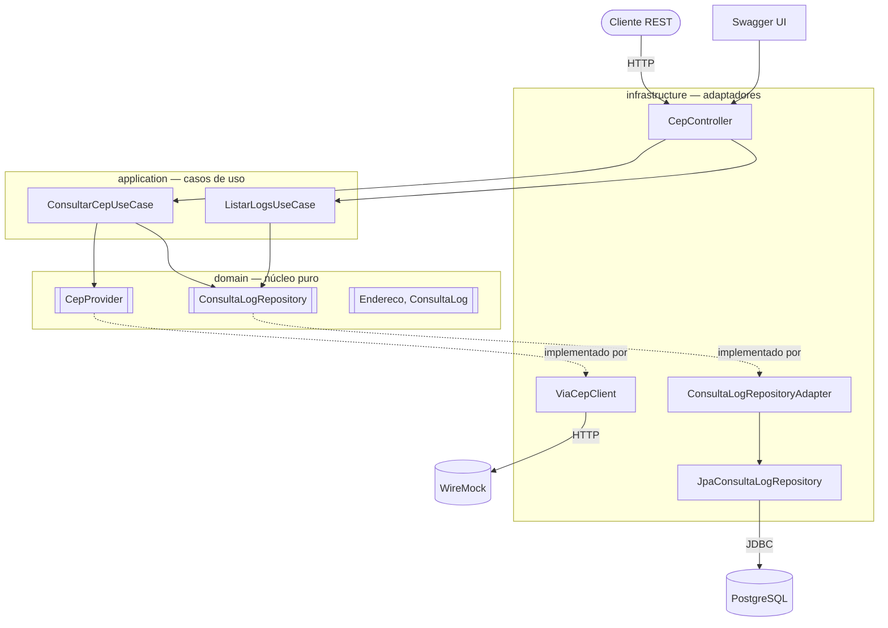

# Arquitetura

## Arquitetura Hexagonal (Ports & Adapters)

A aplicação é organizada em três camadas concêntricas. As dependências apontam
sempre **de fora para dentro**: adaptadores dependem de casos de uso, que
dependem do domínio. O domínio não depende de ninguém.

## Fluxo de uma consulta

1. Cliente faz `GET /api/cep/01310-100` (via curl, Swagger UI ou outro).
2. `CepController` (adaptador de entrada) recebe e delega para `ConsultarCepUseCase`.
3. `ConsultarCepUseCase` sanitiza o CEP (remove máscara, valida 8 dígitos).
4. Chama `CepProvider.buscar(cep)`. A implementação injetada é o `ViaCepClient`,
   que faz um HTTP GET no WireMock (ou no ViaCEP real).
5. Com o `Endereco` retornado, o caso de uso chama `ConsultaLogRepository.salvar(...)`
   — a implementação `ConsultaLogRepositoryAdapter` traduz `ConsultaLog` (domínio)
   em `ConsultaLogEntity` (JPA) e persiste.
6. Controller converte `Endereco` em `EnderecoResponse` (DTO) e retorna `200 OK`.

Fluxos alternativos:

- **CEP inválido:** `ConsultarCepUseCase` lança `CepInvalidoException` antes
  de chamar o provedor. Retorno: `400`. Log **não é gravado** (entrada inválida).
- **CEP não encontrado:** o provedor lança `CepNaoEncontradoException`, o caso
  de uso registra log com `status=NAO_ENCONTRADO` e propaga. Retorno: `404`.
- **Falha técnica no provedor:** `ProvedorCepException`, log com `status=ERRO`
  e mensagem. Retorno: `502`.

## Tabela `consulta_log`

| Coluna                | Tipo          | Descrição                                        |
|-----------------------|---------------|--------------------------------------------------|
| `id`                  | BIGSERIAL PK  | Identificador auto-gerado                        |
| `cep`                 | VARCHAR(9)    | CEP consultado (já sanitizado, apenas dígitos)   |
| `data_hora_consulta`  | TIMESTAMP     | Momento da consulta                              |
| `status`              | VARCHAR(20)   | `SUCESSO`, `NAO_ENCONTRADO` ou `ERRO`            |
| `resposta_api`        | TEXT          | JSON retornado pelo provedor (ou erro)           |

Criação automática via `ddl-auto=update` (adequado para desafio; em produção
usaríamos Flyway ou Liquibase com migrations versionadas).

## Containers (docker-compose)

| Container       | Imagem                     | Porta  | Função                                  |
|-----------------|----------------------------|--------|------------------------------------------|
| `cep-app`       | build local                | 8080   | Aplicação Spring Boot                   |
| `cep-wiremock`  | `wiremock/wiremock:3.6.0`  | 8081   | Mock da API de CEP                      |
| `cep-postgres`  | `postgres:16-alpine`       | 5432   | Banco de dados dos logs                 |

O `app` espera o `postgres` ficar saudável (healthcheck) antes de subir.

## Decisões de design

- **Arquitetura hexagonal** isola o domínio de qualquer detalhe técnico.
  Trocar Postgres por Mongo, ViaCEP por um provedor gRPC, REST por GraphQL —
  nada disso afeta o núcleo.
- **Dois perfis (`default` e `docker`)** permitem rodar a aplicação sem Docker
  para o app, usando H2 em memória.
- **Log persistido em 3 cenários** (sucesso, não encontrado, erro do provedor)
  — entrada inválida não gera log, porque essa falha não envolve consulta
  externa e poderia ser usada para flood.
- **Sanitização antecipada do CEP**: o CEP é normalizado no caso de uso antes
  de qualquer operação, garantindo consistência nos logs e permitindo que o
  controller aceite formatos como `01310-100`, `01310100` e `01310 100`.

## Implantação em AWS (diferencial)

Sugestão para levar o projeto para a nuvem:

- **ECS Fargate** ou **EKS** rodando a imagem da aplicação.
- **RDS PostgreSQL** (Amazon Aurora, compatível com JPA/Hibernate) no lugar do
  container `postgres`.
- **API Gateway + ALB** na frente.
- **Secrets Manager** para as credenciais do banco.
- **CloudWatch Logs** ingerindo o stdout do container.
- **OpenTelemetry** enviando traces para X-Ray.
- O WireMock não vai para produção — a `cep.provider.base-url` aponta para o
  ViaCEP real (ou outro provedor homologado).
